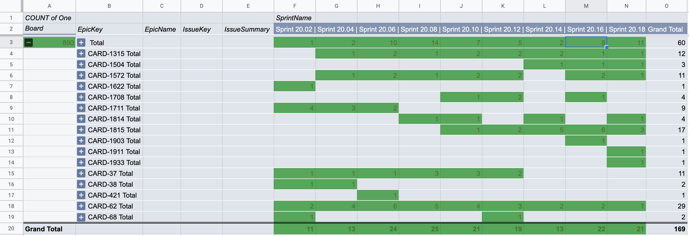
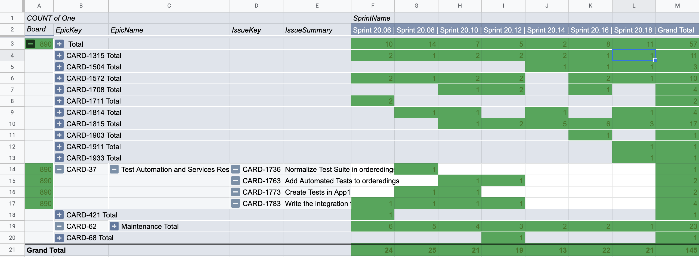

# jira-epic-based-timeline

Visualize the workstreams of your teams in a timeline without having to deal with start and delivery dates! Just use the information you already have available, without any extra effort.

From a given agile board, it gets all cards in the 'x' most recent sprints and then group cards per sprint in order to display a timeline like this:

 . | . | Sprint 20.02 | Sprint 20.04 | Sprint 20.06
--- | --- | :---: | :---: | :---:
**Epic A** | | | | 
 |  | `Card A.1` | 1 | 1 |   
 |  | `Card A.2` | 1 |   |
 |  | `Card A.3` |   |   | 1
**Epic B** | | | |         |  |   | 
 |  | `Card B.1` | 1 | 1  | 1
 |  | `Card B.2` |  |   | 1

The 1s flag indicates that the card in this row was part of the commitment the team made for the iteration represented in its column. So, imagine that a sequence of 1s in the same row as a workstrem in the timeline.

For example, in the table above you can see that `Card A.1`, which is a deliverable of the **Epic A**, started in Sprint 20.02 but was carried over into Sprint 20.04.

You'll be able to:
- display the above table in the standard output in a txt format; or
- export data to a CSV file that you can either import to Google Spreadsheet in order to create a pivot table in the format above.

By importing this data to a Google Spreadsheet, you will be able to visualise not only cards but also Epics as a workstream in the timeline. This can be achieved by SUM()ing all 1s associated to each individual epic.

After importing the CSV to a Google Spreasheet, just create a pivot table with the following configuration/fields:
- Rows: Board, EpicKey, EpicName, IssueKey, IssueSummary;
- Columns: Sprint Name;
- Values: Ones (SummarIzed by COUNT).

Note that you may also work with cards/epics from more than one Board.

Example of data imported to Google Spreasheets

